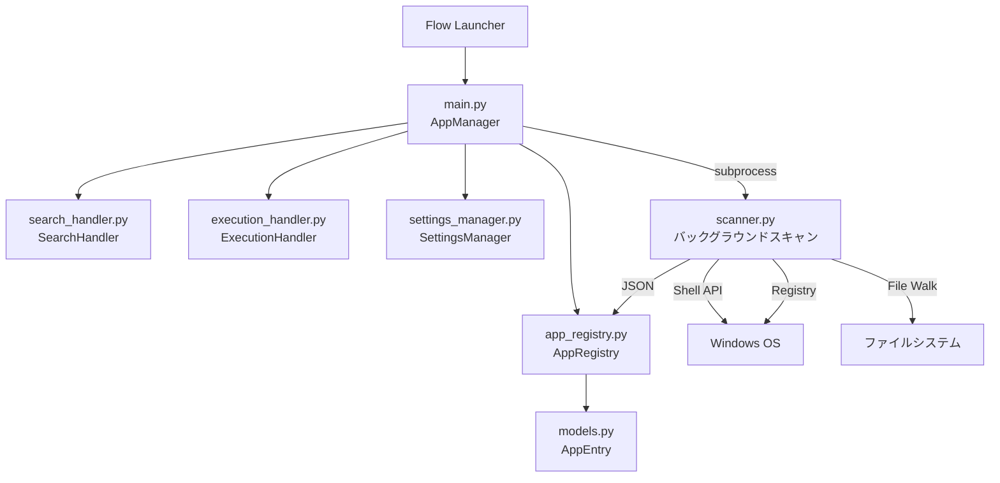

<p align="center">
  
</p>

<h1 align="center">App Manager</h1>

<p align="center">
  <b>インストール済みアプリケーションを高速に検索・起動する Flow Launcher プラグイン</b>
</p>

<p align="center">
  
  
  
  
</p>

---

## ✨ 概要

**App Manager** は、Windows にインストールされているすべてのアプリケーションを統合的に検索・起動できる [Flow Launcher](https://www.flowlauncher.com/) プラグインです。

Windows 標準のアプリ一覧（Win32 / UWP）に加え、ユーザー指定のカスタムパスまで横断的にスキャンし、利用履歴やエイリアス設定に基づいて**思考を妨げない最短・最速のアプリ起動体験**を提供します。

## 🚀 主な機能

| 機能 | 説明 |
|------|------|
| 🔍 **統合アプリ検索** | Shell API・レジストリ・カスタムパスからアプリを自動収集し、一元的に検索 |
| ⚡ **高速レスポンス** | キャッシュ機構とバックグラウンドスキャンにより 100ms 以内の応答速度を維持 |
| 📝 **エイリアス** | アプリに任意の別名を定義し、短いキーワードで即座にアクセス |
| 📌 **ピン留め** | よく使うアプリを検索結果の最上位に固定 |
| 🕐 **履歴ベースのソート** | 直近に使用したアプリを優先表示し、自然な使い勝手を実現 |
| 🚫 **ブラックリスト** | 不要なアプリを検索結果から非表示に |
| 💾 **エクスポート/インポート** | 設定と履歴を JSON ファイルでバックアップ・復元 |
| 🧹 **自動データクレンジング** | 存在しなくなったアプリの情報を自動的に整理（外部ドライブは猶予期間あり） |

## 📦 インストール

### Flow Launcher 経由（推奨）

> ⚠️ プラグインストアへの公開後に利用可能です。

```
pm install App Manager
```

### 手動インストール

1. [Releases](https://github.com/app-manager-plugin) ページから最新のリリースをダウンロード
2. Flow Launcher のプラグインディレクトリに展開:
   ```
   %APPDATA%\FlowLauncher\Plugins\App Manager\
   ```
3. Flow Launcher を再起動

## 🎯 使い方

### 基本操作

Flow Launcher を起動し、アクションキーワード `ap` に続けて検索クエリを入力します。

| 入力例 | 動作 |
|--------|------|
| `ap ` | 利用履歴順にすべてのアプリを一覧表示 |
| `ap chrome` | 「chrome」でアプリ名をファジー検索 |
| `ap c` | エイリアスに `c` を登録していれば即座にマッチ |

### コンテキストメニュー（右クリック）

検索結果のアプリ上で右クリック（または `Shift + Enter`）すると、以下の操作が可能です:

- **ファイルの場所を開く** — エクスプローラーでアプリの所在フォルダを表示
- **ピン留め / ピン解除** — 検索結果の最上位に固定
- **ブラックリストに追加** — 検索結果から非表示

## ⚙️ 設定

Flow Launcher の **設定 → プラグイン → App Manager** から以下をカスタマイズできます:

| 設定項目 | 説明 | デフォルト |
|----------|------|-----------|
| **エイリアス設定** | `アプリ名=エイリアス1,エイリアス2` の形式で別名を定義 | — |
| **カスタムスキャンパス** | 追加でスキャンするディレクトリパス（1行に1つ） | — |
| **データクレンジング猶予日数** | 外部ドライブのアプリが再検出されなかった場合の削除猶予日数 | `30` |
| **自動スキャン間隔（分）** | アプリ一覧の自動再スキャン間隔（0 = 毎回） | `60` |
| **レジストリスキャン** | Shell API で取得できないアプリをレジストリから補完 | `有効` |
| **エクスポート先フォルダ** | フォルダ指定で次回使用時に自動エクスポート | — |
| **インポートファイル** | JSON ファイル指定で次回使用時に自動インポート | — |

### エイリアス設定例

```
Calculator=c,calc
Visual Studio Code=code,vsc
Google Chrome=chrome,gc
```

## 🏗️ アーキテクチャ

```
App Manager/
├── main.py                 # エントリーポイント（FlowLauncher 継承）
├── models.py               # AppEntry データモデル定義
├── app_registry.py         # キャッシュ管理（app_cache.json の読み書き）
├── scanner.py              # バックグラウンドスキャナー（サブプロセス実行）
├── search_handler.py       # 検索ロジック・結果構築・ランキング
├── execution_handler.py    # アプリ起動・履歴更新・ピン留め操作
├── settings_manager.py     # 設定管理・エクスポート/インポート
├── plugin.json             # プラグインメタデータ
├── SettingsTemplate.yaml   # Flow Launcher GUI 設定テンプレート
├── requirements.txt        # Python 依存パッケージ
├── Images/                 # アイコンアセット
│   ├── app.png
│   ├── pin.png
│   ├── block.png
│   └── open_folder.png
├── tests/                  # ユニットテスト
│   ├── conftest.py
│   ├── test_models.py
│   ├── test_app_registry.py
│   ├── test_search_handler.py
│   └── test_settings_manager.py
└── docs/                   # 設計ドキュメント
    ├── Requirements.md
    └── Specification.md
```

### モジュール構成



### データフロー

1. **起動時**: `main.py` → キャッシュ存在確認 → スキャン判定 → 検索実行
2. **スキャン**: `scanner.py` が Shell API / レジストリ / カスタムパスからアプリを収集し `app_cache.json` に保存
3. **検索時**: `search_handler.py` がキャッシュ済みエントリに対しランキング付きの結果を返却
4. **実行時**: `execution_handler.py` がアプリを起動し、履歴を更新

## 🔧 開発

### 前提条件

- **Python** 3.10+
- **Flow Launcher** 最新版
- **Windows** 10 / 11

### セットアップ

```bash
# リポジトリのクローン
git clone https://github.com/app-manager-plugin.git
cd "App Manager"

# 依存パッケージのインストール
pip install -r requirements.txt
```

### テストの実行

```bash
pytest tests/ -v
```

### 依存パッケージ

| パッケージ | 用途 |
|------------|------|
| `flowlauncher` | Flow Launcher プラグイン SDK |
| `comtypes` | Windows COM API（Shell API 経由のアプリ列挙） |

## 📄 ライセンス

このプロジェクトは MIT ライセンスの下で公開されています。

## 🙏 謝辞

- [Flow Launcher](https://www.flowlauncher.com/) — 高速なキーボードランチャー
- [Flow Launcher Plugin SDK (Python)](https://github.com/Flow-Launcher/Flow.Launcher.Plugin.Python) — Python プラグイン開発基盤
